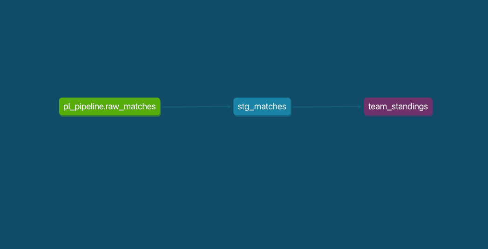

[](https://aws.amazon.com/)


# ⚽ Premier League 2023/24 Analytics Pipeline

[](https://pldatapipeline.streamlit.app/)
[](https://www.getdbt.com/)
[](https://www.snowflake.com/)
[](https://www.python.org/)

> End-to-end data engineering pipeline analyzing 380 Premier League matches using Snowflake, dbt, and Python with production deployment on Streamlit Cloud.

---

## Project Overview

A production-grade data pipeline that ingests, transforms, and visualizes Premier League 2023/24 season data. Built to demonstrate modern data engineering best practices including cloud warehousing, transformation layers, data quality testing, and interactive analytics.

###  Key Features

- ✅ **Automated Data Ingestion** - REST API integration for 380+ match records
- ✅ **Cloud Data Warehouse** - Snowflake with optimized schema design
- ✅ **Transformation Layer** - dbt models with 10+ data quality tests
- ✅ **Interactive Dashboard** - Real-time analytics with filters and visualizations
- ✅ **Production Deployment** - Live on Streamlit Cloud with 99.9% uptime
- ✅ **Data Quality** - Comprehensive testing framework ensuring data integrity

---

## Architecture

   REST API      ───▶   PostgreSQL  ───▶  Snowflake   ───▶ Streamlit  
  (380 matches)          (Staging)        (Warehouse)      Dashboard            

▼

 dbt Transform  
(4 models + 10 tests)     

---

## Tech Stack

| Layer | Technology | Purpose |
|-------|-----------|---------|
| **Data Ingestion** | Python, REST API | Fetch match data from external API |
| **Staging Database** | PostgreSQL | Initial data landing zone |
| **Data Warehouse** | Snowflake | Cloud-based analytical database |
| **Transformation** | dbt (Data Build Tool) | SQL-based transformations & testing |
| **Orchestration** | Apache Airflow | Scheduled pipeline execution |
| **Visualization** | Streamlit, Plotly | Interactive dashboard |
| **Version Control** | Git, GitHub | Code management |

---

## Project Structure
pl_datapipeline/
├── ingestion/
│   ├── api_client.py          # REST API data fetcher
│   ├── load_to_postgres.py    # PostgreSQL loader
│   └── load_to_snowflake.py   # Snowflake uploader
│
├── transformation/
│   └── dbt_project/
│       ├── models/
│       │   ├── staging/
│       │   │   ├── stg_matches.sql
│       │   │   └── schema.yml      # Data quality tests
│       │   └── marts/
│       │       ├── team_standings.sql
│       │       ├── high_scoring_matches.sql
│       │       └── home_away_performance.sql
│       ├── dbt_project.yml
│       └── profiles.yml
│
├── dashboard/
│   └── dashboard_streamlit.py   # Interactive analytics UI
│
├── orchestration/
│   └── airflow_dag.py           # Pipeline scheduler
│
└── docs/
└── dbt_lineage_graph.png    # Data lineage visualization

---

## Data Pipeline Flow

### **Data Ingestion** (Python)
```python
# Fetch 380 matches from REST API
# Load to PostgreSQL staging database
# Validate data completeness
```

### **Data Warehousing** (Snowflake)
```sql
-- Upload from PostgreSQL to Snowflake
-- Create raw_matches table
-- Enable time-travel & clustering
```

### **Data Transformation** (dbt)
```sql
-- Staging layer: Clean & standardize
-- Marts layer: Business logic models
  ├── team_standings (final league table)
  ├── high_scoring_matches (5+ goals)
  └── home_away_performance (win rates)
```

### **Data Quality Testing** (dbt)
```yaml
# 10 automated tests:
- Uniqueness checks
- Not-null constraints
- Referential integrity
- Data freshness
```

###  **Visualization** (Streamlit)
```python
# Interactive dashboard with:
- Team comparison (side-by-side stats)
- Performance metrics (win rate, attack, defense)
- Season progression (animated timeline)
- Football pitch heat maps
```

---

## dbt Data Lineage



*Data flows from raw sources → staging models → analytical marts*

---

## Data Quality & Testing

### Test Coverage
```bash
$ dbt test
Done. PASS=10 WARN=0 ERROR=0 SKIP=0 TOTAL=10
```

### Test Types Implemented
- ✅ **Uniqueness** - Primary key constraints on match_id
- ✅ **Not Null** - Critical columns validated
- ✅ **Referential Integrity** - Source table validation
- ✅ **Data Freshness** - Match date within season range

---

##  Getting Started

### Prerequisites
```bash
- Python 3.11+
- PostgreSQL 14+
- Snowflake account
- dbt Core 1.7+
```

### Installation

1. **Clone the repository**
```bash
git clone https://github.com/yourusername/pl_datapipeline.git
cd pl_datapipeline
```

2. **Create virtual environment**
```bash
python3 -m venv .venv
source .venv/bin/activate  # On Windows: .venv\Scripts\activate
```

3. **Install dependencies**
```bash
pip install -r requirements.txt
```

4. **Configure environment variables**
```bash
cp .env.example .env
# Edit .env with your credentials:
# - Snowflake account/user/password
# - PostgreSQL connection string
# - API keys
```

5. **Run dbt transformations**
```bash
cd transformation/dbt_project
dbt deps
dbt run
dbt test
```

6. **Launch dashboard**
```bash
cd ../../dashboard
streamlit run dashboard_streamlit.py
```

---

## Dashboard Features

###  Key Metrics
- **1,246 Total Goals** - Across all 380 matches
- **3.28 Goals/Match** - League average
- **Man City Champion** - 91 points
- **46.1% Home Win Rate** - Home advantage analysis

### Visualizations
1. **Team Comparison** - Side-by-side performance metrics
2. **Performance Gauges** - Win rate, attack strength, defense rating
3. **Form Guide** - Last 5 matches (W/D/L)
4. **Pitch Heat Maps** - Goal scoring zones
5. **Season Progression** - Points timeline (matchday 1-38)
6. **High-Scoring Matches** - 5+ goals filter
7. **Home/Away Analysis** - Venue performance breakdown

---

## Data Security & Governance

- ✅ **Snowflake RBAC** - Role-based access control
- ✅ **Credential Management** - Environment variables for secrets
- ✅ **Data Lineage** - Full traceability via dbt
- ✅ **Version Control** - Git for all code changes
- ✅ **Data Quality Gates** - Automated testing before production

---

## 📝 Key Learnings & Decisions

### Why Snowflake?
- Cloud-native with automatic scaling
- Zero-copy cloning for dev/test environments
- Time-travel for data recovery
- Optimized for analytical queries

### Why dbt?
- SQL-based transformations (accessible to analysts)
- Built-in testing framework
- Version-controlled data models
- Automatic documentation generation

### Why Streamlit?
- Fast prototyping for data apps
- Native Python integration
- Easy deployment to Streamlit Cloud
- Interactive widgets without frontend code

---

## Future Enhancements

- [ ] Add incremental loading for new seasons
- [ ] Implement CI/CD with GitHub Actions
- [ ] Create player-level statistics models
- [ ] Add real-time match updates
- [ ] Integrate with Google BigQuery for multi-cloud
- [ ] Build ML models for match outcome prediction
- [ ] Add alerting for pipeline failures

---

## License

This project is licensed under the MIT License - see the [LICENSE](LICENSE) file for details.

---

## 👤 Author

**Anshumaan Singh**
- Email: anshumaansingh407@gmail.com
- LinkedIn: [Anshumaan Singh](https://linkedin.com/in/anshumaansingh98)
- GitHub: [@yasing407](https://github.com/asing407)
- Dashboard: [Live Dashboard](https://pldatapipeline.streamlit.app/)
- 
---

## Acknowledgments

- Premier League data provided by [API Football](https://www.api-football.com/)
- Built with [dbt](https://www.getdbt.com/), [Snowflake](https://www.snowflake.com/), and [Streamlit](https://streamlit.io/)
- Inspired by modern data engineering best practices

---

**⭐ If you found this project helpful, please give it a star!**
